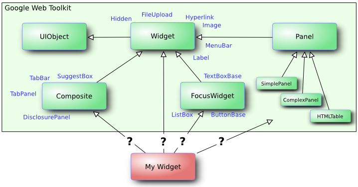
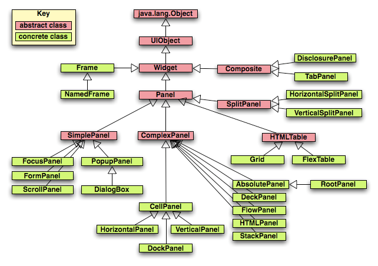

Generated by GWT WebAppCreator
==============================

Congratulations, you've successfully generated a starter project!  What next?

### How to create GWT application

    $ jenv install gwt 2.8.0
    $ webAppCreator -noant -maven -XnoEclipse -out MyGwtWebApp org.mvnsearch.MyGwtWebApp

Then use IntelliJ IDEA to open the project and modify the GWT facet settings.

### Using Maven

If you have generated your project with the option '-maven', you have a 'pom.xml'
file ready to use. Assuming you have Maven installed in your system, 'mvn' is 
in your path, and you have access to maven repositories, you should be able to run:

mvn clean         # delete temporary stuff
mvn test          # run all the tests (gwt and junit)
mvn gwt:devmode   # run development mode (needs "mvn package" to be run before)
mvn package       # generate a .war package ready to deploy

For more information about other available goals, read Maven and gwt-maven-plugin 
documentation (http://maven.apache.org, https://tbroyer.github.io/gwt-maven-plugin/)

### Glossary

* User View: HTML page that includes a reference to a GWT module `.nocache.js`
* GWT Module: Module Name = Java Package + Module File Name (-gwt.xml)
* UIObject <- Widget <- Panel <- ComplexPanel <-- XoxoPanel
* Widget: a component of your web application with which the user may interact.
* Panel: a widget that can hold one or more other widgets in a specific visual/functional structure

### References

* Spring Boot with GWT: https://github.com/interseroh/demo-gwt-springboot
* GWT Release Notes: http://www.gwtproject.org/release-notes.html
